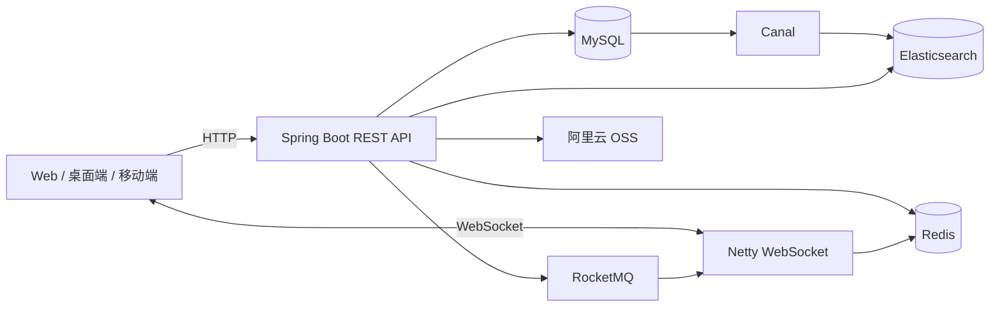

# Msg Relay

Msg Relay 是一个基于 Spring Boot 的即时通信后端，采用 Maven 多模块组织，包含用户与组织、单聊/群聊、WebSocket 实时推送、消息可靠性、文件上传和全文检索等能力。

## 功能特性

- 用户登录、双 Token 刷新与多设备管理
- 单聊、群聊、会话列表、消息撤回与用户侧隐藏
- Netty WebSocket 长连接、心跳检测与在线状态维护
- Redis Pub/Sub 跨节点推送与 Caffeine + Redis 多级缓存
- RocketMQ 事务消息、消费幂等、ACK 与死信监控
- 大群推拉结合、群消息已读位图
- Canal 订阅 MySQL Binlog，并同步消息到 Elasticsearch
- 阿里云 OSS 文件上传与下载

## 技术栈

| 类别 | 技术 |
| --- | --- |
| 基础框架 | Java 17、Spring Boot 3.4.5、Maven |
| 数据存储 | MySQL 8.0、Redis 7、Elasticsearch 8.14.1 |
| 数据访问 | MyBatis 3.0.4 |
| 消息与同步 | RocketMQ 5.2.0、Canal 1.1.7 |
| 长连接 | Netty WebSocket |
| 缓存与并发 | Caffeine、Redisson |
| 认证与存储 | JJWT、阿里云 OSS |

## 系统架构



## 模块说明

| 模块 | 说明 |
| --- | --- |
| `msg-relay-common` | 通用返回、异常、JWT、缓存、分布式锁和基础配置 |
| `msg-relay-user` | 用户、团队、部门、认证和设备管理 |
| `msg-relay-im` | 消息、会话、WebSocket、在线状态和消息投递 |
| `msg-relay-reliability` | 消息 ACK、已读记录与可靠性相关模型 |
| `msg-relay-group` | 群组、成员、权限和大群索引 |
| `msg-relay-file` | 阿里云 OSS 文件服务 |
| `msg-relay-search` | Elasticsearch 全文检索与 Canal 同步 |
| `msg-relay-starter` | 应用入口与运行时配置 |

## 快速开始

### 1. 环境要求

- JDK 17
- Maven 3.9+
- Docker Desktop，支持 Docker Compose v2
- Windows PowerShell（仅使用一键启动脚本时需要）

### 2. 获取项目

```bash
git clone <你的仓库地址>
cd msg-relay
```

### 3. 准备环境变量

复制配置模板并修改其中的示例值：

```powershell
Copy-Item .env.example .env
```

```bash
cp .env.example .env
```

Docker Compose 会自动读取根目录的 `.env`。直接通过 Maven 启动应用时，Spring Boot 不会自动加载该文件，需要在终端或 IDE 中设置同名环境变量；未设置时会采用 `application.yml` 中仅供本地开发使用的默认值。

关键配置如下：

| 变量 | 是否必需 | 说明 |
| --- | --- | --- |
| `DB_PASSWORD` | 建议 | MySQL root 密码，本地默认 `root` |
| `JWT_SECRET` | 生产必需 | JWT 签名密钥，至少 32 字节的高强度随机值 |
| `OSS_ACCESS_KEY_ID` | 文件功能必需 | 阿里云 OSS AccessKey ID |
| `OSS_ACCESS_KEY_SECRET` | 文件功能必需 | 阿里云 OSS AccessKey Secret |
| `OSS_ENDPOINT` | 否 | OSS Endpoint |
| `OSS_BUCKET_NAME` | 文件功能必需 | OSS Bucket 名称 |
| `NODE_ID` | 多实例必需 | WebSocket 节点标识 |
| `SNOWFLAKE_WORKER_ID` | 多实例必需 | 雪花算法工作节点 ID |
| `SNOWFLAKE_DATACENTER_ID` | 多实例必需 | 雪花算法数据中心 ID |

### 4. 启动中间件

推荐使用 Compose：

```bash
docker compose up -d
docker compose ps
```

Windows 也可以执行项目提供的脚本：

```powershell
.\docker\start.ps1
```

> 首次构建 Elasticsearch 镜像需要下载 IK 分词插件，请确保 Docker 可以访问插件地址。

### 5. 构建并启动应用

```bash
mvn clean package
java -jar msg-relay-starter/target/msg-relay-starter-0.0.1-SNAPSHOT.jar
```

开发时也可以直接运行：

```bash
mvn spring-boot:run -pl msg-relay-starter -am
```

应用启动后可访问：

| 服务 | 地址 |
| --- | --- |
| REST API | `http://localhost:8080` |
| WebSocket | `ws://localhost:8090/ws` |
| MySQL | `localhost:3307` |
| Redis | `localhost:6379` |
| Elasticsearch | `http://localhost:9200` |
| RocketMQ Dashboard | `http://localhost:9009` |

## 接口与认证

REST 接口统一使用 `/api` 前缀，主要分组如下：

- `/api/user`：登录、用户、团队、部门和设备
- `/api/im`：消息、会话和在线状态
- `/api/group`：群组及成员管理
- `/api/reliability`：消息 ACK
- `/api/file`：文件上传与下载
- `/api/search`：消息全文检索

除登录和刷新 Token 外，请求需要携带访问令牌：

```http
Authorization: Bearer <access-token>
```

WebSocket 连接建立后，客户端需要先发送以下文本帧完成认证：

```text
AUTH <access-token>
```

认证成功后服务端返回 `AUTH_OK`，后续心跳使用 WebSocket Ping/Pong 控制帧。

## 常用命令

```bash
# 编译并运行测试
mvn test

# 完整校验
mvn verify

# 停止中间件（保留数据卷）
docker compose down

# 停止并删除本地数据卷，请谨慎执行
docker compose down -v
```

## 设备登录会话与双 JWT

- Access Token 默认 2 小时，Refresh Token 默认 7 天；都包含 `sub`（userId）、`deviceId`、`tokenType` 和 `exp`。Token 和 Token hash 均不落库。
- HTTP 和 WebSocket 只接受 ACCESS；刷新接口只接受 REFRESH。三条链路和 WebSocket 心跳都通过 Redis 缓存检查 `userId + deviceId` 对应的有效登录会话，MySQL 是最终状态来源。
- `t_login_device` 每对用户/设备保留一行，退出后逻辑删除，再登录恢复该行。同一用户的登录事务通过用户行锁串行检查最多五台设备，新设备超额时撤销最久未活跃的会话。
- `POST /api/user/auth/logout` 只需要 Bearer Access Token，不再读取客户端传入的 deviceId。远端踢人仍使用 `DELETE /api/user/device/{deviceId}`。
- WebSocket 认证格式为 `AUTH <access-token>`，设备标识从 Token 提取。退出、踢人、超额淘汰统一在数据库提交后发布 KICK，节点关闭连接并清理 Presence；漏收通知时由心跳检查兜底。
- Redis `online:u:*` / `online:route:*` 只表示 WebSocket 在线状态，用于判断在线和多实例路由。登录会话独立使用 `login:session:{userId}:{deviceId}`，值 `1` / `0` 表示有效/无效，默认分别缓存 300 秒 / 30 秒，通过 `msg-relay.login-session.cache-ttl-seconds` 和 `negative-cache-ttl-seconds` 配置。缓存命中无需查询 MySQL；刷新仍会查询用户信息以检查封禁。
- 缓存未命中时先设置短期 LOADING 标记，再查 MySQL；Lua 仅允许持有原标记的请求回填，防止踢人前启动的旧查询覆盖撤销状态。并发加载或会话变更期间临时回源、不回填。
- 登录、退出和踢人在数据库提交前将缓存标记为 UPDATING，提交/回滚结束后按标记删除，下次请求按数据库当前状态重建缓存。提交前 Redis 更新失败会回滚设备变更，不返回假成功；Redis 读取故障时鉴权回源 MySQL。
- UPDATING 标记不设过期时间，提交结果未知或进程崩溃留下标记时，该设备持续回源 MySQL。确认写事务已经结束后，可删除对应 `login:session:*` 单个 key 恢复缓存；不要直接写入有效状态。
- 刷新返回双 Token，但没有一次性轮换机制：旧 Refresh Token 在自身到期前、对应设备会话有效时仍可使用。同一设备重新登录并恢复会话后，该设备尚未过期的旧 Token 也会再次有效；此模型不区分同一设备的不同登录批次。


## 开源协议

使用 [Apache License 2.0](LICENSE) 开源。
